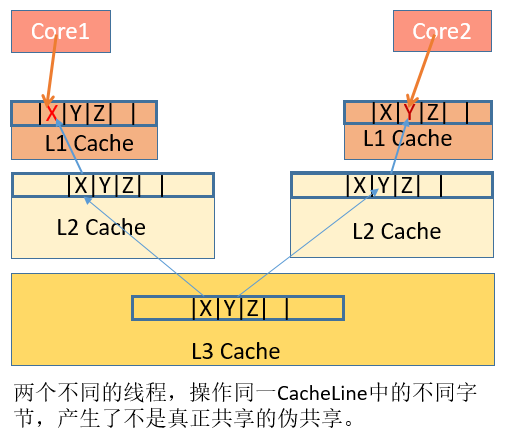

# CPU缓存

随着CPU的频率不断提升，而内存的访问速度却没有质的突破，为了弥补访问内存的速度慢，充分发挥CPU的计算资源，提高CPU整体吞吐量，在CPU与内存之间引入了一级Cache。 一般来说，一级Cache可以分为一级数据缓存（Data Cache，D-Cache）和一级指令缓存（Instruction Cache，I-Cache）。随着热点数据体积越来越大，一级Cache L1已经不满足发展的要求，引入了二级Cache L2，三级Cache L3。


# 缓存行

CPU缓存是由很多个缓存行组成的。每个缓存行通常是64字节，并且它有效地引用主内存中的一块儿地址，并拷贝主内存对应地址中的数据。缓存行是CPU与主内存数据交换的最小单位。CPU每次从主存中拉取数据时，会把相邻的数据也存入同一个缓存行。

# 伪共享



数据X、Y、Z被加载到同一Cache Line中，线程A在Core1修改X，线程B在Core2上修改Y。根据MESI大法，假设是Core1是第一个发起操作的CPU核，Core1上的L1 Cache Line由S（共享）状态变成M（修改，脏数据）状态，然后告知其他的CPU核，图例则是Core2，引用同一地址的Cache Line已经无效了；当Core2发起写操作时，首先导致Core1将X写回主存，Cache Line状态由M变为I（无效），而后才是Core2从主存重新读取该地址内容，Cache Line状态由I变成E（独占），最后进行修改Y操作， Cache Line从E变成M。可见多个线程操作在同一Cache Line上的不同数据，相互竞争同一Cache Line，导致线程彼此牵制影响，变成了串行程序，降低了并发性。此时我们则需要将共享在多线程间的数据进行隔离，使他们不在同一个Cache Line上，从而提升多线程的性能。

# 解决伪共享方案


## 1、填充方式

正确的方式应该将该对象属性分组，将一起变化的放在一组，与其他属性无关的属性放到一组，将不变的属性放到一组。这样当每次对象变化时，不会带动所有的属性重新加载缓存，提升了读取效率。在JDK1.8以前，我们一般是在属性间增加长整型变量来分隔每一组属性。

```java
public class DataPadding{
    long a1,a2,a3,a4,a5,a6,a7,a8;//防止与前一个对象产生伪共享
    int value;
    long modifyTime;
    long b1,b2,b3,b4,b5,b6,b7,b8;//防止不相关变量伪共享;
    boolean flag;
    long c1,c2,c3,c4,c5,c6,c7,c8;//
    long createTime;
    char key;
    long d1,d2,d3,d4,d5,d6,d7,d8;//防止与下一个对象产生伪共享

```

## 2、Contended注解方式

在JDK1.8中，新增了一种注解@sun.misc.Contended，来使各个变量在Cache line中分隔开。注意，jvm需要添加参数-XX:-RestrictContended才能开启此功能。

```java
// 类前加上代表整个类的每个变量都会在单独的cache line中
@sun.misc.Contended
@SuppressWarnings("restriction")
public class ContendedData {
    int value;
    long modifyTime;
    boolean flag;
    long createTime;
    char key;
}
或者这种：
// 属性前加上时需要加上组标签
@SuppressWarnings("restriction")
public class ContendedGroupData {
    @sun.misc.Contended("group1")
    int value;
    @sun.misc.Contended("group1")
    long modifyTime;
    @sun.misc.Contended("group2")
    boolean flag;
    @sun.misc.Contended("group3")
    long createTime;
    @sun.misc.Contended("group3")
    char key;
}
```

