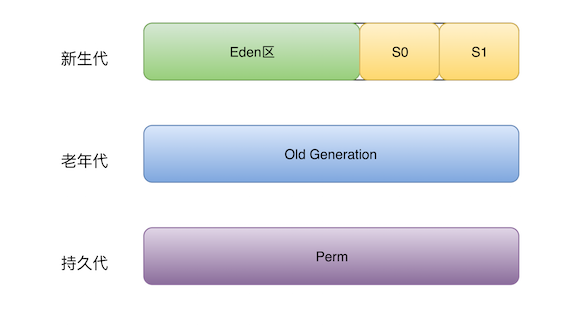

通过收集GC信息，结合系统需求，明确性能目标（例如：停顿时间、GC时间在整个时间所占用的百分比），确定优化方案。例如选用合适的GC回收器、重新设置内存比例、调整JVM参数等。

 

# 调整堆的大小

选择堆的大小其实是一种平衡。如果分配的堆过小，则程序的大部分时间可能都消耗在GC上，没有足够的时间去运行应用程序的逻辑。如果分配的堆过大，GC停顿消耗的时间取决于堆的大小，堆越大，停顿时间可能越长。设置堆内存的大小，不能超过系统内存的容量。否则操作系统会使用磁盘来充当不足的那部分内存，会导致性能的严重下降。

| -Xms | 设置初始值 |
| ---- | ---------- |
| -Xmx | 设置最大值 |

# 设置内存比例

各分区的大小对GC的性能影响很大。如何将各分区调整到合适的大小，分析活跃数据的大小是很好的切入点。

**活跃数据的大小**是指，应用程序稳定运行时长期存活对象在堆中占用的空间大小，也就是Full GC后堆中老年代占用空间的大小。可以通过GC日志中Full GC之后老年代数据大小得出，比较准确的方法是在程序稳定后，多次获取GC数据，通过取平均值的方式计算活跃数据的大小。活跃数据和各分区之间的比例关系如下：

| 空间   | 倍数                                    |
| ------ | --------------------------------------- |
| 总大小 | **3-4** 倍活跃数据的大小                |
| 新生代 | **1-1.5** 活跃数据的大小                |
| 老年代 | **2-3** 倍活跃数据的大小                |
| 永久代 | **1.2-1.5** 倍Full GC后的永久代空间占用 |

例如，根据GC日志获得老年代的活跃数据大小为300M，那么各分区大小可以设为：

> 
>
> 总堆：1200MB = 300MB × 4 *新生代：450MB = 300MB × 1.5* 老年代： 750MB = 1200MB - 450MB

这部分设置仅仅是堆大小的初始值，后面的优化中，可能会调整这些值，具体情况取决于应用程序的特性和需求。

| -XX:NewRatio   | 设置新生代占堆内存的比例（young = heap / (1 + NewRatio)），默认为2 |
| -------------- | ------------------------------------------------------------ |
| -XX:NewSize    | 设置新生代空间的初始值大小                                   |
| -XX:MaxNewSize | 设置新生代空间的最大大小                                     |

# 永久代与元空间

| -XX:PermSize         | 设置永久代的初始值（jdk1.7） |
| -------------------- | ---------------------------- |
| -XX:MaxPermSize      | 设置永久代的最大值（jdk1.7） |
| -XX:MetaspaceSize    | 设置元空间的初始值（jdk1.8） |
| -XX:MaxMetaspaceSize | 设置元空间的最大值（jdk1.8） |

# 控制并发

除Serial收集器之外几乎所有的垃圾收集器使用的算法都基于多线程。合理的设置线程数量，有助于提升垃圾收集的性能。一般情况下，服务器上如果运行了多个JVM实例，则所有JVM实例的垃圾收集线程等于CPU核的数量。

| -XX:ParallelGCThreads | 设置垃圾收集线程数量 |
| --------------------- | -------------------- |
|                       |                      |