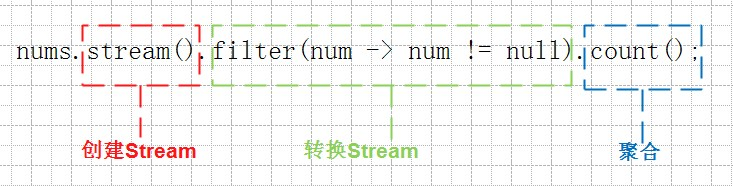
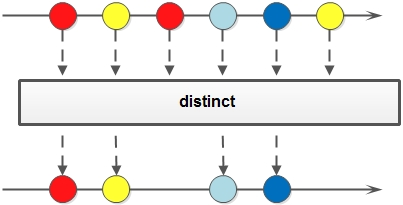
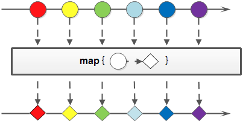

# Lambda

## 语法

1. 参数类型省略–绝大多数情况，编译器都可以从上下文环境中推断出lambda表达式的参数类型。

   ```java
   (param1,param2, ..., paramN) -> {
   	statment1;
       statment2;
       // ......
       return statmentN;
   }
   ```

2. 当lambda表达式的参数个数只有一个，可以省略小括号

   ```java
   param1 -> {
   	statment1;
       statment2;
       // ......
       return statmentN;
   }
   ```

3. 当lambda表达式只包含一条语句时，可以省略大括号、return和语句结尾的分号。

   ```java
   param1 -> statment
   ```

4. 方法引用。

   - objectName::instanceMethod
   - ClassName::staticMethod
   - ClassName::instanceMethod

5. 构造引用。

   ClassName::new

## 参数

lambda表达式其实是快速创建SAM接口的语法糖，原先的SAM接口都可以访问接口外部变量，因此lambda表达式也是可以访问外部变量的，不过lambda表达式访问外部变量有一个非常重要的限制：变量不可变。

在lambda中，this不是指向lambda表达式产生的那个SAM对象，而是声明它的外部对象。 

# Stream

## 语法



红色框中的语句是一个Stream的生命开始的地方，负责创建一个Stream实例；绿色框中的语句是赋予Stream灵魂的地方，把一个Stream转换成另外一个Stream，红框的语句生成的是一个包含所有nums变量的Stream，经过绿框的filter方法以后，重新生成了一个过滤掉原nums列表所有null以后的Stream；蓝色框中的语句是丰收的地方，把Stream的里面包含的内容按照某种算法来汇聚成一个值。

## 创建Stream

1. 通过Stream接口的静态工厂方法
2. 通过Collection接口的默认方法

## 转换Stream

1. distinct：对于Stream中包含的元素进行去重操作（去重逻辑依赖元素的equals方法），新生成的Stream中没有重复的元素。

   

2. filter：对于Stream中包含的元素使用给定的过滤函数进行过滤操作，新生成的Stream只包含符合条件的元素。

   

3. map: 对于Stream中包含的元素使用给定的转换函数进行转换操作，新生成的Stream只包含转换生成的元素。

   

4. flatMap：和map类似，不同的是其每个元素转换得到的是Stream对象，会把子Stream中的元素压缩到父集合中。

   

5. peek: 生成一个包含原Stream的所有元素的新Stream，同时会提供一个消费函数（Consumer实例），新Stream每个元素被消费的时候都会执行给定的消费函数。

   

6. limit: 对一个Stream进行截断操作，获取其前N个元素，如果原Stream中包含的元素个数小于N，那就获取其所有的元素。

   

7. skip: 返回一个丢弃原Stream的前N个元素后剩下元素组成的新Stream，如果原Stream中包含的元素个数小于N，那么返回空Stream。

   

   ## 汇聚Stream
