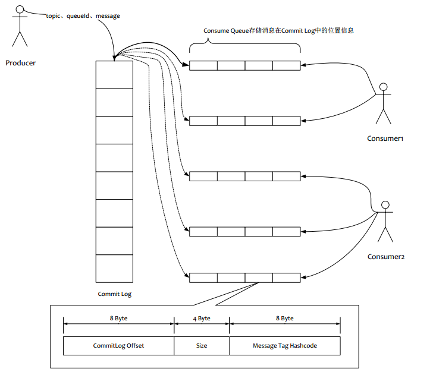

# 架构


## NameServer

NameServer是RocketMQ的名称服务器，主要负责对Topic和路由信息的管理。各个角色的组件都需要定期向NameServer上报自己的状态，超时不上报的话，NameServer会认为某个机器出现了故障，其他组件会把这个机器从可用列表中移除。

### 特点

- NameServer集群中各节点之间互不通信，其他组件同时向所以NameServer上报信息；
- NameServer中管理的数据全部保存在内存当中，不会持久化存储；
- 如果中途所有NameServer全都挂了，只会影响到路由信息的更新，不会影响客户端和Broker的通信。

### 比较

ZooKeeper

## Producer

## Consumer

## Broker

Broker是RocketMQ的核心。主要负责接收Producer发送的消息、处理Consumer的消费请求、消息的持久化和消息的HA机制等。

### 消息存储



#### 顺序写

磁盘以一种恒定的速度旋转。为了读和写，磁头必须定位于指定的磁道，才能开始读写操作。磁头定位到磁道所需的时间称为**寻道时间**，事实证明这个时间很难减少；执行读写操作的时间称为**传送时间**。顺序写的方式，节省了寻道时间，相比较于随机写提高了磁盘IO的读写性能。

#### mmap

Linux操作系统分为内核态和用户态，常采用IO缓冲技术提高IO性能。即：

1. 从磁盘复制数据到内核态内存；
2. 从内核态内存复制到用户态内存；

因此一次IO读写过程，需要进行四次的数据拷贝。

而通过mmap的方式，把文件的内容被映像到计算机虚拟内存的一块区域，不需要进行多余的拷贝，这样就可以直接操作内存当中的数据而无需操作的时候每次都通过I/O去物理硬盘写文件的。详情请看文章：。

#### 实现

CommitLog类负责Broker中的消息存储。CommitLog类中维护了一个映射文件队列mappedFileQueue。mappedFileQueue队列中记录了消息持久化的磁盘的文件信息MappedFile，每个文件默认大小1G。CommitLog调用putMessage方法存储消息，获取最新的MappedFile，再通过MappedByteBuffer将消息写进MappedFile的内存映射。MappedFile中记录了最新的写入位置wrotePosition，保证文件的顺序写入。同时在CommitLog类中，还维护了一个独立的线程flushCommitLogService，执行刷盘操作，将内存映射中的数据写入磁盘。

### 刷盘

在RocketMQ当中支持两种刷盘方式。

#### 同步刷盘

消息写入内存映射中之后，立刻通知刷盘线程刷盘，然后等待刷盘完成；刷盘完成之后，返回消息写入成功。

#### 异步刷盘

消息写入内存映射之后，返回写入成功。当内存中消息积累到一定程度时，唤醒刷盘线程，统一出发写磁盘的操作。

#### 实现

```java
public void handleDiskFlush(AppendMessageResult result, PutMessageResult putMessageResult, MessageExt messageExt) {
    // Synchronization flush
    if (FlushDiskType.SYNC_FLUSH == this.defaultMessageStore.getMessageStoreConfig().getFlushDiskType()) {
        final GroupCommitService service = (GroupCommitService) this.flushCommitLogService;
        if (messageExt.isWaitStoreMsgOK()) {
            //之所以阻塞是因为request中有闭锁，当GroupCommitService从队列中取出request并执行完刷盘之后，闭锁释放
            GroupCommitRequest request = new GroupCommitRequest(result.getWroteOffset() + result.getWroteBytes());
            //将请求放入requestsWrite的list中
            service.putRequest(request);
            //阻塞闭锁，等待刷盘结束
            boolean flushOK = request.waitForFlush(this.defaultMessageStore.getMessageStoreConfig().getSyncFlushTimeout());
            if (!flushOK) {
                log.error("do groupcommit, wait for flush failed, topic: " + messageExt.getTopic() + " tags: " + messageExt.getTags()
                    + " client address: " + messageExt.getBornHostString());
                putMessageResult.setPutMessageStatus(PutMessageStatus.FLUSH_DISK_TIMEOUT);
            }
        } else {
            service.wakeup();
        }
    }
    // Asynchronous flush
    else {
        if (!this.defaultMessageStore.getMessageStoreConfig().isTransientStorePoolEnable()) {
            flushCommitLogService.wakeup();
        } else {
            commitLogService.wakeup();
        }
    }
}
```

### 主从同步

RocketMQ的Broker分为Master和Slave两个角色。Master提供读写服务，而Slave只提供读服务。因此，在Master接收到消息后，要把消息同步到Slave上，这样一旦Master宕机，Slave依然可以提供服务。主从同步分为：

- 同步复制方式：Master接收到消息之后，立即同步给Slave，Master和Slave均写入成功之后返回；
- 异步复制方式：只要Master写入成功之后就返回成功，由同步线程异步执行同步操作。

#### 实现

```java
public void handleHA(AppendMessageResult result, PutMessageResult putMessageResult, MessageExt messageExt) {
    if (BrokerRole.SYNC_MASTER == this.defaultMessageStore.getMessageStoreConfig().getBrokerRole()) {   //同步主节点
        HAService service = this.defaultMessageStore.getHaService();
        if (messageExt.isWaitStoreMsgOK()) {
            // Determine whether to wait
            if (service.isSlaveOK(result.getWroteOffset() + result.getWroteBytes())) {
                GroupCommitRequest request = new GroupCommitRequest(result.getWroteOffset() + result.getWroteBytes());
                service.putRequest(request);
                service.getWaitNotifyObject().wakeupAll();
                boolean flushOK =
                    request.waitForFlush(this.defaultMessageStore.getMessageStoreConfig().getSyncFlushTimeout());
                if (!flushOK) {
                    log.error("do sync transfer other node, wait return, but failed, topic: " + messageExt.getTopic() + " tags: "
                        + messageExt.getTags() + " client address: " + messageExt.getBornHostNameString());
                    putMessageResult.setPutMessageStatus(PutMessageStatus.FLUSH_SLAVE_TIMEOUT);
                }
            }
            // Slave problem
            else {
                // Tell the producer, slave not available
                putMessageResult.setPutMessageStatus(PutMessageStatus.SLAVE_NOT_AVAILABLE);
            }
        }
    }

}
```

### 最佳实践

需要合理的设置刷盘方式和主从复制方式。通常情况下，应该把Master和Slave配置成ASYNC_FLUSH（异步刷盘），主从之间配置成SYNC_MASTER（同步复制）的方式，这样即使有一台机器出故障，仍然能保证数据不丢失。

## 应用

### 顺序消息

### 消息重复

### 消息优先级

### 消息过滤

### 定时消息


