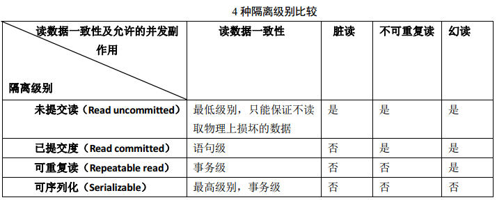
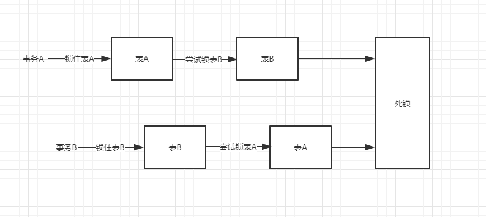

所谓事务是用户定义的一个数据库操作系列，这些操作要么全部执行，要么全部不执行，是一个不可分割的工作单位。

# 特性

### 原子性

事务作为一个整体被执行，包含在其中的对数据库的操作要么全部被执行，要么都不执行。

### 一致性

事务应确保数据库的状态从一个一致状态转变为另一个一致状态。一致状态的含义是数据库中的数据应满足完整性约束。

### 隔离性

多个事务并发执行时，一个事务的执行不应影响其他事务的执行。

### 持久性

一个事务一旦提交，他对数据库的修改应该永久保存在数据库中。

# 隔离级别

## 冲突问题

### 脏读

脏读是指在一个事务处理过程里读取了另一个未提交的事务中的数据。

### 不可重复读

不可重复读是指在对于数据库中的某个数据，一个事务范围内多次查询却返回了不同的数据值，这是由于在查询间隔，被另一个事务修改并提交了。比如事务A中两处读取数据-total-的值。在第一读的时候，total是100，然后事务B就把total的数据改成200，事务A再读一次，结果就发现，total竟然就变成200了，造成事务A数据混乱。

### 幻读

幻读是指当事务不是独立执行时发生的一种现象。例如事务A读取一条指定where条件的语句，返回结果集。此时事务B插入一行新记录，恰好满足A的where条件。然后A使用相同的条件再次查询，结果集中可以看到B插入的记录，这条新纪录就是幻想。（防不住新增）

不可重复读和脏读的区别是，脏读是某一事务读取了另一个事务未提交的脏数据，而不可重复读则是读取了前一事务提交的数据。幻读和不可重复读都是读取了另一条已经提交的事务（这点就脏读不同），所不同的是不可重复读查询的都是同一个数据项，而幻读针对的是一批数据整体（比如数据的个数）。

## 隔离级别



###  **READ_UNCOMMITTED**

读未提交：最低级别，一个事务可以读取另一个未提交事务的数据。幻想读、不可重复读和脏读都允许。

###  **READ_COMMITTED** 

读已提交：一个事务要等另一个事务提交后才能读取数据。允许幻想读、不可重复读，不允许脏读。

###  **REPEATABLE_READ** 

可重复读：在开始读取数据（事务开启）时，不再允许修改操作。允许幻想读，不允许不可重复读和脏读。

###  **SERIALIZABLE**

可串行化：最高级别，在该级别下，事务串行化顺序执行。幻想读、不可重复读和脏读都不允许。

# 锁

## 类型

### 悲观锁

悲观锁是指假设并发更新冲突会发生，所以不管冲突是否真的发生，都会使用锁机制。

悲观锁根据使用性质，又可以分为：

- **共享锁（S锁）：**对数据进行读操作。因此多个事务可以同时为一个对象加共享锁。
- **排它锁（X锁）：**排他锁表示对数据进行写操作。如果一个事务对对象加了排他锁，其他事务就不能再给它加任何锁了。

排它锁

```
SELECT ... FOR UPDATE;
```

共享锁

```
SELECT ... LOCK IN SHARE MODE;
```

悲观锁根据作用范围，又可以分为：

- **表锁：** 开销小，加锁快；不会出现死锁；锁定粒度大，发生锁冲突的概率最高，并发度最低。
- **行锁：** 开销大，加锁慢；会出现死锁；锁定粒度最小，发生锁冲突的概率最低，并发度也最高。
- **页锁：** 开销和加锁时间界于表锁和行锁之间；会出现死锁；锁定粒度界于表锁和行锁之间，并发度一般。

### 乐观锁

乐观锁假设认为数据一般情况下不会造成冲突，所以在数据进行提交更新的时候，才会正式对数据的冲突与否进行检测，如果发现冲突了，则让返回用户错误的信息，让用户决定如何去做。

实现数据版本有两种方式，第一种是使用版本号，第二种是使用时间戳。

## 死锁

## 情景一



一个用户A 访问表A(锁住了表A),然后又访问表B；另一个用户B 访问表B(锁住了表B)，然后企图访问表A；这时用户A由于用户B已经锁住表B，它必须等待用户B释放表B才能继续，同样用户B要等用户A释放表A才能继续，这就死锁就产生了。 

### 原因

两个事务以不同的循序来锁住两个相同的表，就有可能会造成死锁。

### 解决方法

这种死锁比较常见，是由于程序的BUG产生的，除了调整的程序的逻辑没有其它的办法。仔细分析程序的逻辑，对于数据库的多表操作时，尽量按照相同的顺序进 行处理，尽量避免同时锁定两个资源，如操作A和B两张表时，总是按先A后B的顺序处理， 必须同时锁定两个资源时，要保证在任何时刻都应该按照相同的顺序来锁定资源。

## 情景二

用户A查询一条纪录，然后修改该条纪录；这时用户B修改该条纪录，这时用户A的事务里锁的性质由查询的共享锁企图上升到独占锁，而用户B里的独占锁由于A 有共享锁存在所以必须等A释放掉共享锁，而A由于B的独占锁而无法上升到独占锁也就不可能释放共享锁，于是出现了死锁。这种死锁比较隐蔽，但在稍大点的项目中经常发生。如在某项目中，页面上的按钮点击后，没有使按钮立刻失效，使得用户会多次快速点击同一按钮，这样同一段代码对数据库同一条记录进行多次操作，很容易就出现这种死锁的情况。 

### 原因

共享锁与排它锁的特性引起的死锁

### 解决方法

1. **防止重复提交。**可以防止一部分并发的可能。
2. **使用乐观锁进行控制。**乐观锁大多是基于数据版本（Version）记录机制实现。即为数据增加一个版本标识，在基于数据库表的版本解决方案中，一般是 通过为数据库表增加一个“version”字段来实现。读取出数据时，将此版本号一同读出，之后更新时，对此版本号加一。此时，将提交数据的版本数据与数 据库表对应记录的当前版本信息进行比对，如果提交的数据版本号大于数据库表当前版本号，则予以更新，否则认为是过期数据。乐观锁机制避免了长事务中的数据库加锁开销（用户A和用户B操作过程中，都没有对数据库数据加锁），大大提升了大并发量下的系统整体性能表现。Hibernate 在其数据访问引擎中内置了乐观锁实现。需要注意的是，由于乐观锁机制是在我们的系统中实现，来自外部系统的用户更新操作不受我们系统的控制，因此可能会造 成脏数据被更新到数据库中。 
3. **使用悲观锁进行控制。**悲观锁大多数情况下依靠数据库的锁机制实现，如Oracle的Select … for update语句，以保证操作最大程度的独占性。但随之而来的就是数据库性能的大量开销，特别是对长事务而言，这样的开销往往无法承受。如一个金融系统， 当某个操作员读取用户的数据，并在读出的用户数据的基础上进行修改时（如更改用户账户余额），如果采用悲观锁机制，也就意味着整个操作过程中（从操作员读 出数据、开始修改直至提交修改结果的全过程，甚至还包括操作员中途去煮咖啡的时间），数据库记录始终处于加锁状态，可以想见，如果面对成百上千个并发，这样的情况将导致灾难性的后果。所以，采用悲观锁进行控制时一定要考虑清楚。 

## 情景三

如果在事务中执行了一条不满足条件的update语句，则执行全表扫描，把行级锁上升为表级锁，多个这样的事务执行后，就很容易产生死锁和阻塞。类似的情 况还有当表中的数据量非常庞大而索引建的过少或不合适的时候，使得经常发生全表扫描，最终应用系统会越来越慢，最终发生阻塞或死锁。

### 原因

行锁与表锁阻塞。

### 解决方法

使用索引优化，尽量防止全表扫描。