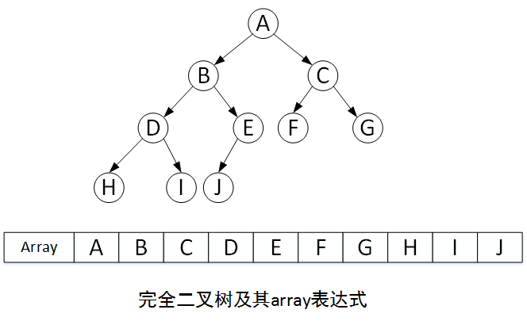
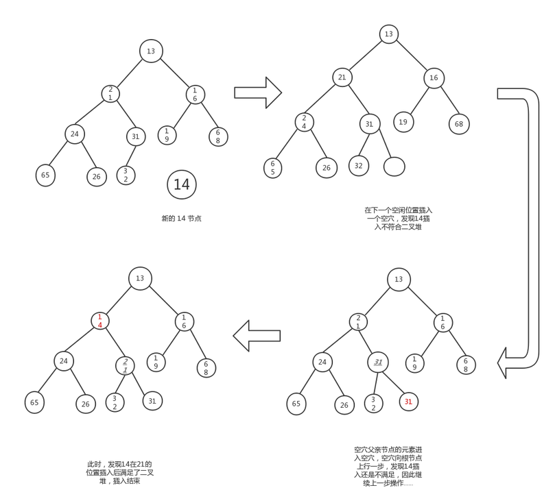
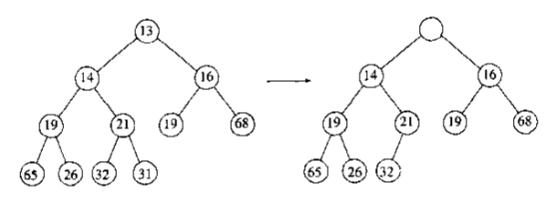

二叉堆是一种特殊的堆，是一棵完全二叉树。

特性：

- 完全二叉树
- 最大堆：父节点总是大于等于子节点；最小堆：父节点总是小于等于子节点

二叉堆常用数组实现。并且对于数组中的任意位置i上的元素，其左儿子在位置2i上，其右儿子在左儿子后的2i+1上，其父节点在i/2取整数的位置上。（注意：根节点的位置是1，数组从1位置开始排列，0位置为空）



## 插入

二叉堆插入的过程是一个上滤的过程。

1. 将新节点插入到完全二叉树中的最后
2. 与父节点进行比较，当小于父节点时，跟父节点互换，此时新节点上移（假设为最小堆）
3. 直到大于父节点，插入完成



插入

```java
public void insert(T t) {
    // 添加到数组末尾
    list.add(t);
    // 上滤
    for (int i = list.size(); i > 0; i /= 2) {
        // 获取父节点
        int pi = (i / 2) - 1 < 0 ? 0 : (i / 2) - 1;
        T p = list.get(pi);
        // 比较
        if (p.compareTo(t) <= 0) {
            break;
        }
        // 与父节点位置交换
        list.set(pi, t);
        list.set(i - 1, p);
    }
}
```

## 删除

二叉堆每次删除都是删除根节点，通过下滤来调整结构。

1. 删除根节点元素，此时根节点为空节点
2. 比较空节点的两个子节点大小，选择较小的子节点与空节点进行交换，此时空节点下移（假设为最小堆）
3. 当空节点下移到叶子节点后，将完全二叉树中的最后一个元素移到空节点




删除

```java
public T delete() {
    // 删除根节点
    T del = list.get(0);
    // 将最后一个节点设置为根节点
    T last = list.remove(list.size() - 1);
    if (list.size() != 0) {
        // 下滤
        int i = 0;
        list.set(i, last);
        while (i < list.size()) {
            int min = getMinChildIndex(i);
            T t = list.get(min);
            if (i != min && last.compareTo(t) > 0) {
                list.set(i, t);
                list.set(min, last);
                i = min;
            } else {
                break;
            }
        }
    }
    return del;
}

/**
 * 根据父节点索引，获取其最小子节点的索引，若没有子节点，则返回父节点索引
 * @param index
 * @return
 */
private int getMinChildIndex(int index) {
    int left = (index + 1) * 2 - 1;
    int right = (index + 1) * 2;
    if (left < list.size() && right < list.size()) {
        if (list.get(left).compareTo(list.get(right)) > 0) {
            return right;
        } else {
            return left;
        }
    } else {
        return index;
    }
}
```