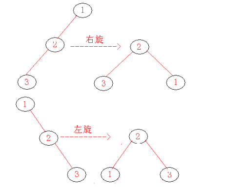

# 二叉树

二叉树是一棵树，其中每个节点都不能有多于两个的字节点。

# 二叉查找树

对于树中的每一个节点X，它的左子树中所有项的值小于X中的项，而它的右子树中所有项的值大于X中的项。这意味这该树所有的元素可以用某种一致的方式排序。

## 插入

二分法遍历树中的节点，如果新插入的节点X的key不存在，则插入为叶子节点，如果存在则更新。

## 删除

当删除节点X时，需要考虑以下几种情况：

1. 若X是叶子节点：直接删除；
2. 若X有一个子节点：则让X的子节点，代替X成为X父节点的子节点；
3. 若X有两个子节点：让X的右子树的最小的节点Y代替X成为X父节点的子节点，并递归的删除原来的Y节点

如果删除的次数不频繁，可以使用懒惰删除的策略：当一个节点要被删除时，它仍留在树中，只是被标记删除。

## 遍历

## 前序排序

根结点 ---> 左子树 ---> 右子树

前序遍历的输出结果：ABDECF

## 中序排序

左子树---> 根结点 ---> 右子树

中序遍历的输出结果：DBEAFC

## 后序排序

左子树 ---> 右子树 ---> 根结点

前序遍历的输出结果：DEBFCA

## 层序遍历

同级节点从左到右，再子节点同级节点从左到右

层序遍历的输出结果：ABCDEF

# 平衡二叉查找树

一棵平衡二叉查找树是其每个节点的左子树和右子树的高度最多差1的二叉查找树。

## 旋转

### 单旋

当新插入节点和其父节点、祖父节点成一条直线时，需要执行单旋操作。单旋分为左旋和右旋。

### 双旋

当新插入节点和其父节点、祖父节点不在一条直线上，成之子型，需要执行双旋操作。根据新插入节点所处的位置，双旋分为：

1. 左-右双旋，即先左旋后右旋
2. 右-左双旋，即先右旋后左旋

## 插入

### 定义

- AVL树：T
- 新插入节点：X
- 递归的将X插入到T的相应的子树：t
- t树中高度较高一侧的子节点：c

插入操作分为几种情况：

1. 插入X之后，t的左右高度差小于2，则表示此次插入没有破坏T的结构；
2. 插入X之后，t的左右高度差等于2
   1. 当c是t的左子节点，且X的值小于c的值时，对t进行右旋；
   2. 当c是t的左子节点，且X的值大于c小于t时，对t进行左-右双旋；
   3. 当c是t的右子节点，且X的值大于c的值时，对t进行左旋；
   4. 当c是t的右子节点，且X的值大于t小于c时，对t进行右-左双旋；

