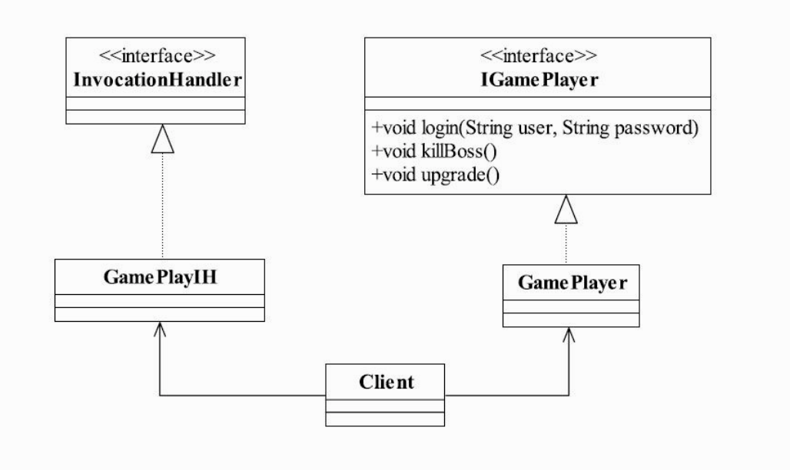

# 代理

代理模式是一种设计模式，提供了对目标对象额外的访问方式，即通过代理对象访问目标对象，这样可以在不修改原目标对象的前提下，提供额外的功能操作，扩展目标对象的功能。简言之，代理模式就是设置一个中间代理来控制访问原目标对象，以达到增强原对象的功能和简化访问方式。

举个例子，我们生活中经常到火车站去买车票，但是人一多的话，就会非常拥挤，于是就有了代售点，我们能从代售点买车票了。这其中就是代理模式的体现，代售点代理了火车站对象，提供购买车票的方法。

## 静态代理

这种代理方式需要代理对象和目标对象实现一样的接口。


### 角色

- Subject：被代理的接口，定义了方法DoAction()；

  ```java
  public interface Subject {
  
      void doAction();
  
  }
  ```

- RealSubject：原对象，真正的业务实现类，实现了Subject接口；

  ```java
  public class RealSubject implements Subject {
  
      @Override
      public void doAction() {
          System.out.println("RealSubject is doing...");
      }
  
  }
  ```

- Proxy：代理类，代理原对象，实现了Subject接口。

  ```java
  public class Proxy implements Subject {
  
      private RealSubject subject;
  
      public Proxy(RealSubject subject) {
          this.subject = subject;
      }
  
      @Override
      public void doAction() {
          System.out.println("Proxy is doing before");
          subject.doAction();
          System.out.println("Proxy is doing after");
      }
  
  }
  ```

### 优劣

#### 优点

- 可以在不修改目标对象的前提下扩展目标对象的功能。

#### 缺点

- 冗余，由于代理对象要实现与目标对象一致的接口，会产生过多的代理类；
- 不易维护，一旦接口增加方法，目标对象与代理对象都要进行修改。

## 动态代理

动态代理是在实现阶段不用关心代理谁，而在运行阶段才动态的指定代理哪一个对象。

### jdk

jdk中使用到了一个接口InvocationHandler和一个代理类Proxy ，这两个类配合使用实现了动态代理的功能。InvocationHandler 并实现它的invoke方法，然后再用Proxy的工厂方法newProxyInstance()创建一个代理对象，这个对象同样可以实现对具体类的代理功能。而且想代理哪个具体类，只要给Handler（以下代码中的Invoker）的构造器传入这个具体对象的实例就可以了。

#### 示例



```java
public interface IGamePlayer {

    void login(String user, String password);

    void killBoss();

    void upgrade();

}
```

```java
public class GamePlayer implements IGamePlayer {

    @Override
    public void login(String user, String password) {
        System.out.println("login, user:" + user + ", password:" + password);
    }

    @Override
    public void killBoss() {
        System.out.println("kill boss");
    }

    @Override
    public void upgrade() {
        System.out.println("upgrade");
    }

}
```

```java
public class GamePlayerIH implements InvocationHandler {

    private IGamePlayer gamePlayer;

    public GamePlayerIH(IGamePlayer gamePlayer) {
        this.gamePlayer = gamePlayer;
    }

    @Override
    public Object invoke(Object proxy, Method method, Object[] args) throws Throwable {
        System.out.println("before");
        Object invoke = method.invoke(gamePlayer, args);
        System.out.println("after");
        return invoke;
    }

}
```

```java
public class DynamicProxy {

    public static void main(String[] args) {
        IGamePlayer gamePlayer = new GamePlayer();
        GamePlayerIH handler = new GamePlayerIH(gamePlayer);
        IGamePlayer gamePlayerProxy = (IGamePlayer) Proxy.newProxyInstance(GamePlayer.class.getClassLoader(),
                GamePlayer.class.getInterfaces(),
                handler);
        gamePlayerProxy.login("root", "123");
        gamePlayerProxy.killBoss();
        gamePlayerProxy.upgrade();
    }

}
```

#### 原理

##### InvocationHandler接口

InvocationHandler接口只定义了一个invoke()方法。通过InvocationHandler接口，所有方法都由该Handler来进行处理，即所有被代理的方法都由InvocationHandler接管实际的处理任务。

```java
public Object invoke(Object proxy, Method method, Object[] args)
    throws Throwable;
```

- proxy:代理类对象;
- method:代理类调用的具体方法；
- args:方法的参数。

##### Proxy类

Proxy类提供创建动态代理类和实例的static方法，并且通过这些方法创建所有动态代理类的父类。

```java
public static Object newProxyInstance(ClassLoader loader,
                                      Class<?>[] interfaces,
                                      InvocationHandler h)
    throws IllegalArgumentException
{
    Objects.requireNonNull(h);

    final Class<?>[] intfs = interfaces.clone();
    final SecurityManager sm = System.getSecurityManager();
    if (sm != null) {
        checkProxyAccess(Reflection.getCallerClass(), loader, intfs);
    }

    /*
     * Look up or generate the designated proxy class.
     * 查找或生成代理类
     */
    Class<?> cl = getProxyClass0(loader, intfs);

    /*
     * Invoke its constructor with the designated invocation handler.
     */
    try {
        if (sm != null) {
            checkNewProxyPermission(Reflection.getCallerClass(), cl);
        }

        final Constructor<?> cons = cl.getConstructor(constructorParams);
        final InvocationHandler ih = h;
        if (!Modifier.isPublic(cl.getModifiers())) {
            AccessController.doPrivileged(new PrivilegedAction<Void>() {
                public Void run() {
                    cons.setAccessible(true);
                    return null;
                }
            });
        }
        
        /*
     	* 生成代理对象；在代理对象中调用了handler的invoke()方法
     	*/
        return cons.newInstance(new Object[]{h});
    } catch (IllegalAccessException|InstantiationException e) {
        throw new InternalError(e.toString(), e);
    } catch (InvocationTargetException e) {
        Throwable t = e.getCause();
        if (t instanceof RuntimeException) {
            throw (RuntimeException) t;
        } else {
            throw new InternalError(t.toString(), t);
        }
    } catch (NoSuchMethodException e) {
        throw new InternalError(e.toString(), e);
    }
}
```

### cglib

# AOP