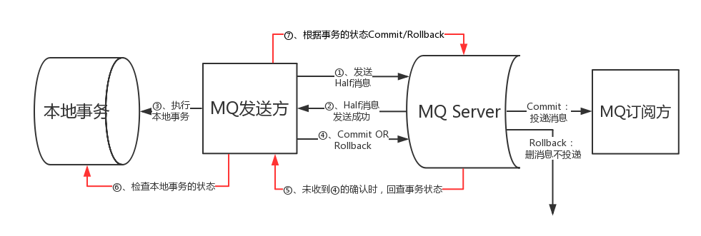

分布式事务顾名思义就是在分布式环境下运行的事务，对于分布式事务来说，事务的每个操作步骤是运行在不同机器上的服务的。分布式事务处理的关键是必须有一种方法可以知道事务在任何地方所做的所有动作，提交或回滚事务的决定必须产生统一的结果（全部提交或全部回滚）

# CAP原则

- 一致性（C）
- 可用性（A）
- 分区容错性（P）

## 一致性

在分布式系统中的所有数据备份，在同一时刻是否同样的值。

### 强一致性

当更新操作完成之后，任何多个后续进程或者线程的访问都会返回最新的更新过的值。这种是对用户最友好的，就是用户上一次写什么，下一次就保证能读到什么。根据 CAP 理论，这种实现需要牺牲可用性。

### 弱一致性

系统并不保证连续进程或者线程的访问都会返回最新的更新过的值。系统在数据写入成功之后，不承诺立即可以读到最新写入的值，也不会具体的承诺多久之后可以读到。

### 最终一致性

系统并不保证续进程或者线程的访问都会返回最新的更新过的值。系统在数据写入成功之后，不承诺立即可以读到最新写入的值，也不会具体的承诺多久之后可以读到。

## 可用性

在集群中一部分节点故障后，集群整体是否还能响应客户端的读写请求。、

## 分区容错性

以实际效果而言，分区相当于对通信的时限要求。系统如果不能在时限内达成数据一致性，就意味着发生了分区的情况，必须就当前操作在C和A之间做出选择。

# 二阶段提交协议

在分布式系统中，每个节点虽然可以知晓自己的操作时成功或者失败，却无法知道其他节点的操作的成功或失败。当一个事务跨越多个节点时，为了保持事务的ACID特性，需要引入一个作为协调者的组件来统一掌控所有参与者节点的操作结果并最终指示这些节点是否要把操作结果进行真正的提交。因此，二阶段提交的算法思路可以概括为：参与者将操作成败通知协调者，再由协调者根据所有参与者的反馈情报决定各参与者是否要提交操作还是中止操作。

- 准备阶段
- 提交阶段

## 准备阶段

1. 协调者节点向所有参与者节点询问是否可以执行提交操作(vote)，并开始等待各参与者节点的响应。 
2. 参与者节点执行询问发起为止的所有事务操作，并将Undo信息和Redo信息写入日志。（注意：若成功这里其实每个参与者已经执行了事务操作） 
3. 各参与者节点响应协调者节点发起的询问。如果参与者节点的事务操作实际执行成功，则它返回一个”同意”消息；如果参与者节点的事务操作实际执行失败，则它返回一个”中止”消息。 

## 提交阶段

如果协调者收到了参与者的失败消息或者超时，直接给每个参与者发送回滚(Rollback)消息；否则，发送提交(Commit)消息；参与者根据协调者的指令执行提交或者回滚操作，释放所有事务处理过程中使用的锁资源。(注意:必须在最后阶段释放锁资源)

# 三阶段提交协议

- 询问阶段
- 准备阶段
- 提交阶段

# TCC

- try：对业务系统进行检查和资源预留
- confirm：执行业务并提交
- cancel：业务回滚，是否预留资源

TCC协议将一个任务拆分成try，confirm，cancel三个步骤。正常的流程会先执行try，如果执行没问题，则执行confirm；如果执行出现了问题，则执行取消操作cancel。

# MQ

通过MQ的事务消息来实现分布式事务。其核心思想是**让上游事务的执行和MQ服务端的消息能否被投递和消费同时成功或者同时失败**，而不会出现本地事务并没有执行成功，但消息已经被订阅方消费的情况。

1. 在执行本地事务之前，发送方先向MQ发送一条事务消息；
2. MQ接收到事务消息之后，会持久化并返回客户端接收成功。此时的消息为半消息，即MQ的订阅方无法感知到该条消息；
3. 发送方执行本地事务，此时会出现两种情况：执行成功、执行失败；
4. 执行成功：向MQ发送commit消息，MQ将消息转为正常的消息，让订阅方消费。执行失败：向MQ发送rollback消息，MQ将删除之前的办消息，订阅方将不会消费消息；
5. 当由于服务宕机或网络抖动等原因，步骤4未成功执行，MQ会定时扫码长时间没有确认的半消息，向发送方确认事务状态；
6. 发送方检查本地事务的执行，向MQ发送commit或rollback消息；

## 缺点

- 下游服务器事务执行失败时，此时上游事务已经执行成功，让上游事务进行回滚代价较高。因此，常采用正向补偿的方式，即通过不断重试或人工干预的方式让下游事务执行成功，使整个链路流程继续向前执行，而避免出现回滚。
- 不适合超过两个以上的事务操作。

# 最终一致性的最佳实践

## 查询模式

任何服务操作都需要提供一个查询接口，用来向外部输出操作执行的状态。服务操作的使用方可以通过查询接口得知服务操作执行的状态，然后根据不同的状态来做不同的处理操作。

## 补偿模式

为了让系统最终达到一致状态而做的努力都叫作补偿。常见的补偿方法：

1. 回滚操作，以达到一致性的目的；
2. 重试机制，例如：记录操作日志，通过异步或者定时抓取的方式来重新执行操作，保证一致性；

## 定期校对模式

各系统在没有达到一致之前，系统间的状态是不一致的。通过第三方核对系统定期的比对状态，当发现有状态不一致的情况后，则通知警报。然后触发补偿机制，修复状态，保持一致性。

三者配合使用。例如：服务调用超时之后，使用查询模式查看目标操作是否成功；如果成功，则返回执行完成；如果没有成功，则触发补偿机制，当补偿机制成功则返回执行完成。同时使用定期校对模式，定期对重要数据进行校对。