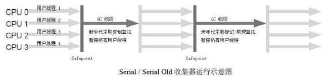
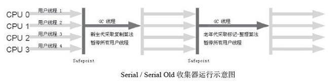
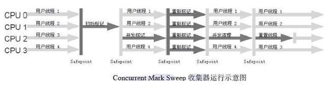

图中展示了7种作用于不同分代的收集器，如果两个收集器之间存在连线，就说明它们可以搭配使用。虚拟机所处的区域，则表示它是属于新生代收集器还是老年代收集器。

# Serial收集器

这个收集器是一个**单线程**的收集器，但它的“单线程”的意义并不仅仅说明它只会使用一个CPU或一条收集线程去完成垃圾收集工作，更重要的是在它进行垃圾收集时，必须暂停其他所有的工作线程（stop the world），直到它收集结束。

## 特点

新生代、老年代都会使用串行回收。 新生代使用复制算法， 老年代使用标记-整理算法。

# **ParNew收集器**

 ParNew收集器其实就是Serial收集器的**多线程版本。**

## 特点

新生代并行，老年代串行。新生代使用复制算法， 老年代使用标记-整理算法。

# **Parallel Scavenge收集器**

 Parallel Scavenge收集器是一个**新生代收集器**，它也是使用**复制算法**的收集器，又是**并行**的多线程收集器。其目标是达到一个可控制的吞吐量。所谓吞吐量就是CPU用于运行用户代码的时间与CPU总消耗时间的比值，即吞吐量=运行用户代码时间/（运行用户代码时间+垃圾收集时间）。所以Parallel Scavenge收集器也被称为“吞吐量优先”的收集器。

## 特点

新生代并行，老年代串行。

# **Serial Old收集器**

 Serial Old是Serial收集器的**老年代版本**，它同样是一个**单线程收集器**，使用**标记－整理**算法。

## 特点

新生代串行，老年代串行。

# **Parallel Old收集器**

 Parallel Old是Parallel Scavenge收集器的**老年代版本**，使用**多线程**和**“标记－整理”**算法。

## 特点

新生代并行，老年代并行。

# **CMS收集器**

 CMS（Concurrent Mark Sweep）收集器是一种以获取最短回收停顿时间为目标的收集器。它是基于**“标记—清除”**算法实现的。

## 执行步骤

### 1、初始标记

标记GC Roots能直接关联到的对象，速度快。会发生“stop the world”。

### 2、并发标记

GC Roots  Tracing。

### 3、重新标记

 修正并发标记期间因用户程序继续运作而导致标记产生变动的那一部分对象的标记记录，这个阶段的停顿时间一般会比初始标记阶段稍长一些，但远比并发标记的时间短。会发生“stop the world”。

### 4、并发清除

并发清除对象。

## 优点

1. 并发收集
2. 低停顿

## 缺点

1. 对CPU资源非常敏感
2. 无法处理浮动垃圾
3. “标记-清除”算法会产生大量空间碎片

# **G1收集器**

在G1之前的其他收集器进行收集的范围都是整个新生代或者老年代，而G1不再是这样。使用G1收集器时，Java堆的内存布局就与其他收集器有很大差别，它将整个Java堆划分为多个大小相等的独立区域（Region），虽然还保留有新生代和老年代的概念，但新生代和老年代不再是物理隔离的了，它们都是一部分Region（不需要连续）的集合。

## 执行步骤

### 1、初始标记

 初始标记阶段仅仅只是标记一下GC Roots能直接关联到的对象，并且修改TAMS（Next Top at Mark Start）的值，让下一阶段用户程序并发运行时，能在正确可用的Region中创建新对象，这阶段需要停顿线程，但耗时很短。

### 2、并发标记

 并发标记阶段是从GC Root开始对堆中对象进行可达性分析，找出存活的对象，这阶段耗时较长，但可与用户程序并发执行。

### 3、最终标记

最终标记阶段是为了修正在并发标记期间因用户程序继续运作而导致标记产生变动的那一部分标记记录，虚拟机将这段时间对象变化记录在线程`Remembered Set Logs`里面，最终标记阶段需要把`Remembered Set Logs`的数据合并到`Remembered Set`中，这阶段需要停顿线程，但是可并行执行。

### 4、筛选回收

 筛选回收阶段首先对各个Region的回收价值和成本进行排序，根据用户所期望的GC停顿时间来制定回收计划，这个阶段其实也可以做到与用户程序一起并发执行，但是因为只回收一部分Region，时间是用户可控制的，而且停顿用户线程将大幅提高收集效率。

# 常用参数

| 参数                           | 描述                                                         |
| ------------------------------ | ------------------------------------------------------------ |
| UseSerialGC                    | 虚拟机运行在Client 模式下的默认值，打开此开关后，使用Serial + Serial Old 的收集器组合进行内存回收。 |
| UseParNewGC                    | 打开此开关后，使用ParNew + Serial Old 的收集器组合进行内存回收。 |
| UseConcMarkSweepGC             | 打开此开关后，使用ParNew + CMS + Serial Old 的收集器组合进行内存回收。Serial Old 收集器将作为CMS 收集器出现Concurrent Mode Failure失败后的后备收集器使用。 |
| UseParallelGC                  | 虚拟机运行在Server 模式下的默认值，打开此开关后，使用Parallel Scavenge + Serial Old（PS MarkSweep）的收集器组合进行内存回收。 |
| UseParallelOldGC               | 打开此开关后，使用Parallel Scavenge + Parallel Old 的收集器组合进行内存回收。 |
| SurvivorRatio                  | 新生代中Eden 区域与Survivor 区域的容量比值， 默认为8， 代表 Eden ：Survivor=8∶1。 |
| PretenureSizeThreshold         | 晋升到老年代的对象年龄。每个对象在坚持过一次Minor GC 之后，年 龄就加1，当超过这个参数值时就进入老年代。 |
| UseAdaptiveSizePolicy          | 动态调整Java 堆中各个区域的大小以及进入老年代的年龄。        |
| HandlePromotionFailure         | 是否允许分配担保失败，即老年代的剩余空间不足以应付新生代的整个Eden 和Survivor 区的所有对象都存活的极端情况。 |
| ParallelGCThreads              | 设置并行GC 时进行内存回收的线程数。                          |
| GCTimeRatio                    | GC 时间占总时间的比率，默认值为99，即允许1% 的GC 时间。仅在 使用Parallel Scavenge 收集器时生效。 |
| MaxGCPauseMillis               | 设置GC 的最大停顿时间。仅在使用Parallel Scavenge 收集器时生效。 |
| CMSInitiatingOccupancyFraction | 设置CMS 收集器在老年代空间被使用多少后触发垃圾收集。默认值为68%，仅在使用CMS 收集器时生效。 |
| UseCMSCompactAtFullCollection  | 设置CMS 收集器在完成垃圾收集后是否要进行一次内存碎片整理。仅在使用CMS 收集器时生效。 |
| CMSFullGCsBeforeCompaction     | 设置CMS 收集器在进行若干次垃圾收集后再启动一次内存碎片整理。仅在使用CMS 收集器时生效。 |