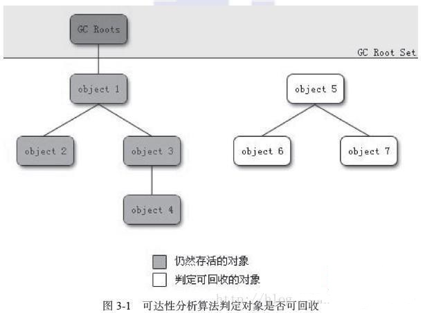
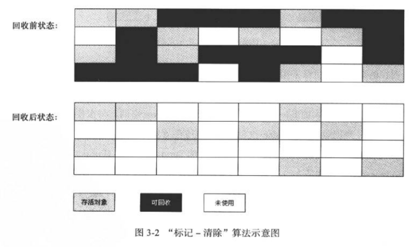
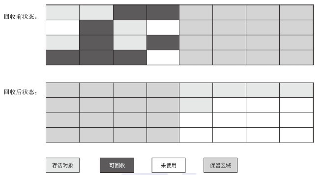
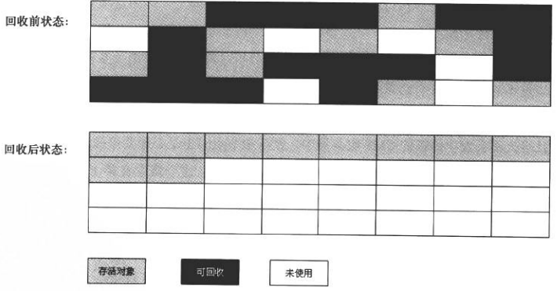

# 标记-清除算法

首先标记出所有需要回收的对象，在标记完成之后统一回收所有被标记的对象。

## 标记算法

### 引用计数法

给对象添加一个引用计数器，每当有一个地方引用它时，计数器加1；当引用失效时，计数器就减1。任何时刻计数器为0的对象就是不能再被使用的。

### 可达性分析法

以一系列的GC Roots对象为起点，从起点开始向下搜索，搜索所有走过的路径称为引用链，当一个对象到GC Roots没有任何引用链时，则证明此对象时不可用的。

在java中，可作为GC Roots的对象有：

1. 虚拟机栈（栈帧中的本地变量表）中引用的对象；
2. 方法区中的类静态属性引用的对象；
3. 方法区中常量引用的对象；
4. 本地方法栈中JNI（即一般说的Native方法）中引用的对象

## 标记-清除算法的不足：

1、效率问题：标记与清除的效率都不高。

2、空间问题：标记清除之后会产生大量不连续的内存碎片，空间碎片太多会导致以后需要分配大对象时，没有连续的内存空间而不得不提前出发另一次垃圾收集动作。

# 复制算法

将可用的内存按容量划分为大小相等的两块，每次只使用其中一块。当一块内存用完了，就将还存在的对象复制到另一块上面，然后再把已使用过的内存空间一次性清理掉。**青年代使用的就是复制算法。**

## 复制算法的不足：

将内存一分为二，可使用的内存缩小到了原来的一半，代价太高。

# 标记-整理算法

标记过程与标记-清除算法一致，但后续步骤不是直接对可回收对象进行清理，而是让所有存活的对象都向一端移动，然后直接清理掉端边界以外的内存。 **老年代使用的就是标记-整理算法。**

# 分代收集算法

根据对象的存活周期不同将内存分为青年代和老年代。

青年代中，每次垃圾收集时都会发现大批对象死去，只有少量存活，因此选用复制算法。将内存分为一块较大的Eden空间和两块较小的Survivor空间，默认比例是8:1。每次使用Eden空间和一块 Survivor空间创建对象。当回收时，将 Eden和 Survivor中还存活的对象一次性复制到另一块 Survivor空间上，最后清理掉 Eden空间和使用过的 Survivor空间。当另一块 Survivor空间不够容纳复制过来的内存时，需要依赖老年代进行分配担保。

老年代对象的存活率较高，因此使用标记-整理算法进行回收。