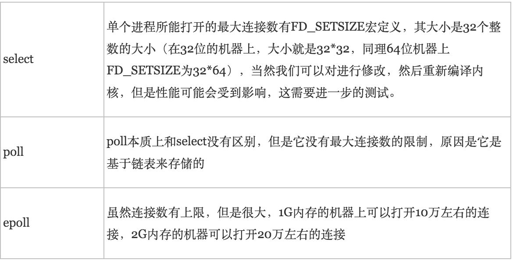

# 多路复用

I/O多路复用通过一种机制，可以监视多个描述符，一旦某个描述符就绪（一般是读就绪或者写就绪，就是这个文件描述符进行读写操作之前），能够通知程序进行相应的读写操作。但select()，poll()，epoll()本质上都是同步I/O，因为他们都需要在读写事件就绪后自己负责进行读写，也就是说这个读写过程是阻塞的，而异步I/O则无需自己负责进行读写，异步I/O的实现会负责把数据从内核拷贝到用户空间。

# select

## 原理

select 函数监视的文件描述符分3类，分别是writefds、readfds、和exceptfds。调用后select函数会阻塞，直到有描述符就绪（有数据 可读、可写、或者有except），或者超时（timeout指定等待时间，如果立即返回设为null即可），函数返回。当select函数返回后，可以通过遍历fdset，来找到就绪的描述符。

## 缺陷

1. select最大的缺陷就是单个进程所打开的FD是有一定限制的，它由FD_SETSIZE设置，默认值是1024。
2. 对socket进行扫描时是线性扫描，即采用轮询的方法，效率较低。

# poll

## 原理

poll本质上和select没有区别，它将用户传入的数组拷贝到内核空间，然后查询每个fd对应的设备状态，如果设备就绪则在设备等待队列中加入一项并继续遍历，如果遍历完所有fd后没有发现就绪设备，则挂起当前进程，直到设备就绪或者主动超时，被唤醒后它又要再次遍历fd。这个过程经历了多次无谓的遍历。

poll没有最大连接数的限制，原因是它是基于链表来存储的。

## 缺陷

1. 大量的fd的数组被整体复制于用户态和内核地址空间之间，而不管这样的复制是不是有意义。

# epoll

## 原理

相对于select和poll来说，epoll更加灵活，没有描述符限制。epoll使用一个文件描述符管理多个描述符，将用户关系的文件描述符的事件存放到内核的一个事件表中，这样在用户空间和内核空间的copy只需一次。

epoll支持水平触发和边缘触发，最大的特点在于边缘触发，它只告诉进程哪些fd刚刚变为就绪态，并且只会通知一次。还有一个特点是，epoll使用“事件”的就绪通知方式，通过epoll_ctl注册fd，一旦该fd就绪，内核就会采用类似callback的回调机制来激活该fd，epoll_wait便可以收到通知。

## 优点

1. 没有最大并发连接的限制，能打开的FD的上限远大于1024（1G的内存上能监听约10万个端口）。
2. 效率提升，不是轮询的方式，不会随着FD数目的增加效率下降。只有活跃可用的FD才会调用callback函数；即Epoll最大的优点就在于它只管你“活跃”的连接，而跟连接总数无关，因此在实际的网络环境中，Epoll的效率就会远远高于select和poll。
3. 内存拷贝，利用mmap()文件映射内存加速与内核空间的消息传递；即epoll使用mmap减少复制开销。

# 区别

## **支持一个进程所能打开的最大连接数**

## **FD剧增后带来的IO效率问题**

## **消息传递方式**

