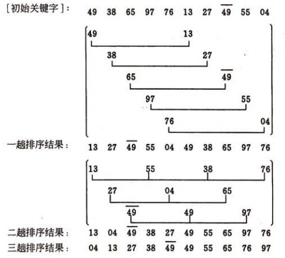
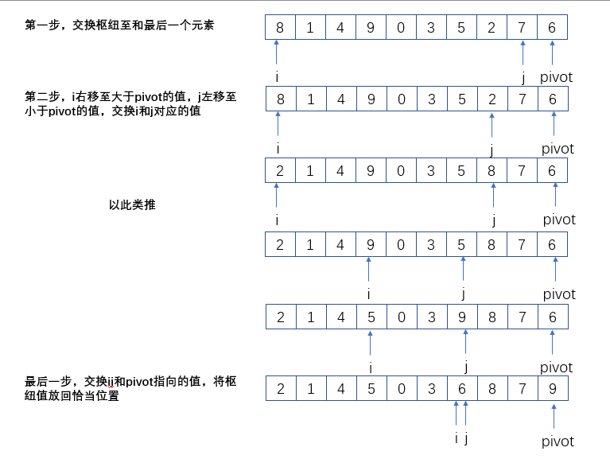

# 插入排序

插入排序是最简单的排序算法之一。插入排序由N-1次排序组成。每一次插入，都保证数组为已排序状态。

时间复杂度：O(n2)。

实现：

```java
/**
 * 插入排序
 * @param array
 * @return
 */
private static int[] insertSort(int[] array) {
    int temp;
    for (int i = 0; i < array.length; i++) {
        for (int j = array.length - 1; j > i; j--) {
            if (array[i] > array[j]) {
                temp = array[i];
                array[i] = array[j];
                array[j] = temp;
            }
        }
    }
    return array;
}
```

# 希尔排序

希尔排序又叫做缩减增量排序，是对插入排序的一种优化算法。它通过比较相距一定间隔的元素来工作；各趟比较所用的距离随着算法的进行而缩小，直到只比较相邻元素的最后一趟排序位置。



实现：

```java
private static int[] shellSort(int[] array) {
    for (int i = array.length / 2; i > 0; i /= 2) {     //定义步长
        for (int j = 0; j < array.length - i; j++) {    //从头至尾逐个执行
            for (int k = i; k < array.length; k += i) { //所有相隔k的两个元素比较
                int temp;
                if (array[k - i] > array[k]) {
                    temp = array[k - i];
                    array[k - i] = array[k];
                    array[k] = temp;
                }
            }
        }
    }
    return array;
}
```

# 堆排序

堆排序是基于二叉堆实现的排序算法。其实现思路：

1. 将无序数组中的元素逐个插入二叉堆；
2. 将根节点R从二叉堆中移除到排序的数组，将二叉堆中最后的节点X放置根节点
3. 对X进行下滤，直到二叉堆满足特性之后，重复2操作

当算法终止时，数组则以排好的顺序包含所有元素。

关于二叉堆，请看文章：。

# 归并排序

归并排序采用递归分治的方式来实现排序。

1. 将原数组分为左、右两个数组；
2. 分别对左、右两个数组进行排序；
3. 将排序完毕的左、右数组，根据排序规则合并成一个数组。


实现：

```java
/**
 * 递归的将数组拆分成左右两个排序好的数组，再合并两个数组
 * @param array
 * @param left
 * @param right
 */
public void mergeSort(int[] array, int left, int right) {
    if (left < right) {
        int center = (right + left) / 2;
        mergeSort(array, left, center);
        mergeSort(array, center + 1, right);
        merge(array, left, center, right);
    }
    return;
}

private void merge(int[] array, int left,int center, int right) {
    int[] temp = new int[right - left + 1];
    int li = left;
    int ri = center + 1;
    for (int i = 0; i < temp.length; i++) {
        if (li < center + 1 && ri < right + 1) {
            if (array[li] < array[ri]) {
                temp[i] = array[li++];
            } else {
                temp[i] = array[ri++];
            }
        } else {
            if (li > center) {  // 左侧的数组已经没有元素了，则将右侧的剩余元素加入temp
                temp[i] = array[ri++];
            } else {            // 反之，将左侧的剩余元素加入temp
                temp[i] = array[li++];
            }
        }
    }
    // 将temp中的元素加入array
    addAll(array, temp, left);
}

private void addAll(int[] array, int[] temp, int start) {
    for (int i = 0; i < temp.length; i++) {
        array[start++] = temp[i];
    }
}
```

# 快速排序

### 原理

从一组未排序的元素中，随机选取一个元素，作为枢纽元。然后让剩余的元素与枢纽元进行比较，将集合分为三部分：小于枢纽元的组成一部分，大于枢纽元的组成一部分，最后是枢纽元单独成为一部分。然后在递归的对小集合和大集合再重复此操作，最终完成排序。

### 实现

1. 选取枢纽元；
   1. 随机选取；
   2. 三数中值选取，取首、尾和中心的三个元素的中值；
2. 将枢纽元与数组的最后一个元素交换位置；
3. 创建两个指针，指针i指向第一个元素，指针j指向倒数第二个元素；
4. 当i在j的左侧时，将i向右移，移过那些小于枢纽元的元素，停留在大于枢纽元的元素上；同时将j向左移，移过那些大于枢纽元的元素，停留在小于枢纽元的元素上；然后将i上的元素与j上的元素互换位置；
5. 当i与j重合或i在j的右侧时，停止两个指针的移动，并将枢纽元与指针i指向的元素交换位置。



实现：

```java
public void queckSort(int[] array, int left, int right) {
    if (left < right) {
        int median = getMedian(array[left], array[(left + right) / 2], array[right]);
        // 将中数交换到数组的最后
        if (median == array[left]) {
            array[left] = array[right];
            array[right] = median;
        } else if (median == array[(left + right) / 2]) {
            array[(left + right) / 2] = array[right];
            array[right] = median;
        }
        // 比较
        int i = left;
        int j = right - 1;
        while (true) {
            while (array[i] < median) {
                i++;
            }
            while (array[j] > median) {
                j--;
            }
            if (i < j) {
                int temp = array[i];
                array[i] = array[j];
                array[j] = temp;
            } else {
                // 枢纽元与i位置的元素交换
                array[right] = array[i];
                array[i] = median;
                break;
            }
        }
        // 递归
        queckSort(array, left, i - 1);
        queckSort(array, i + 1, right);
    }
}

/**
 * 首、中、尾三数取中值 min(max(a, b), c)
 * @param first
 * @param mid
 * @param last
 * @return
 */
private int getMedian(int first, int mid, int last) {
    if (first > mid) {
        if (first > last) {
            if (mid > last) {
                return mid;
            } else {
                return last;
            }
        } else {
            return first;
        }
    } else {
        if (first > last) {
            return first;
        } else {
            if (mid > last) {
                return last;
            } else {
                return mid;
            }
        }
    }
}
```