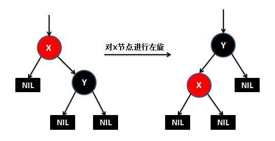

红黑树是具有着色性质的二叉查找树。平均红黑树和评级AVL树一样深，从而查找时间一般接近最优。同时红黑树执行插入操作时，产生的旋转相对较少，性能更优。

# 特性

1. 每一个节点或者是红色，或者是黑色
2. 根是黑色
3. 如果一个节点是红色的，那么它的子节点必须是黑色的
4. 任何一个节点向下遍历到其子孙的叶子节点，所经过的黑节点个数必须相等
5. null节点为黑色

# 旋转

## 左旋

左旋做了三件事： 

1. 将y的左子节点赋给x的右子节点,并将x赋给y左子节点的父节点(y左子节点非空时) 
2. 将x的父节点p(非空时)赋给y的父节点，同时更新p的子节点为y(左或右) 
3. 将y的左子节点设为x，将x的父节点设为y 

## 右旋

右旋做了三件事： 

1. 将x的右子节点赋给y的左子节点,并将y赋给x右子节点的父节点(x右子节点非空时) 
2. 将y的父节点p(非空时)赋给x的父节点，同时更新p的子节点为x(左或右) 
3. 将x的右子节点设为y，将y的父节点设为x 

# 插入

首先，将红黑树当作一颗二叉查找树，将节点插入；然后，将节点着色为红色，这样就不会违背特性4；最后，通过旋转和重新着色等方法来修正该树，使之重新成为一颗红黑树。

新插入的节点分为三种情况：

1. 新插入的节点是根节点，则直接着色为黑色
2. 新插入的节点的父节点是黑色，则不需要做任何操作，就满足红黑树特性
3. 新插入的节点的父节点是红色，则需要进行调整，使得结构满足红黑树特性，此时也有三种情况：

| 1    | 当前节点的父节点是红色，并且其叔叔节点也是红色               | 1、将父节点设为黑色；2、将叔叔节点设为黑色；3、将爷爷节点设为红色；4、将爷爷节点设为当前节点，继续操作 |
| ---- | ------------------------------------------------------------ | ------------------------------------------------------------ |
| 2    | 当前节点的父节点是红色，叔叔节点是黑色，且当前节点、父节点、爷爷节点成一字型 | 1、父节点设为黑色，爷爷节点设为红色；2、对爷爷节点进行单旋   |
| 3    | 当前节点的父节点是红色，叔叔节点是黑色，且当前节点、父节点、爷爷节点成之字型 | 1、将当前节点设为黑色，爷爷节点设为红色；2、对爷爷节点进行双旋 |

# 删除

删除操作会删除对应的节点，如果是叶子节点就直接删除，如果是非叶子节点，会用对应的中序遍历的后继节点来顶替要删除节点的位置。删除后就需要做删除修复操作，使的树符合红黑树的定义，符合定义的红黑树高度是平衡的。

红黑树的删除操作是最复杂的操作，复杂的地方就在于当删除了黑色节点的时候，如何从兄弟节点去借调节点，以保证树的颜色符合定义。由于红色的兄弟节点是没法借调出黑节点的，这样只能通过选择操作让他上升到父节点，而由于它是红节点，所以它的子节点就是黑的，可以借调。

对于兄弟节点是黑色节点的可以分成3种情况来处理，当所以的兄弟节点的子节点都是黑色节点时，可以直接将兄弟节点变红，这样局部的红黑树颜色是符合定义的。但是整颗树不一定是符合红黑树定义的，需要往上追溯继续调整。

对于兄弟节点的子节点为左红右黑或者 (全部为红，右红左黑)这两种情况，可以先将前面的情况通过选择转换为后一种情况，在后一种情况下，因为兄弟节点为黑，兄弟节点的右节点为红，可以借调出两个节点出来做黑节点，这样就可以保证删除了黑节点，整棵树还是符合红黑树的定义的，因为黑色节点的个数没有改变。

红黑树的删除操作是遇到删除的节点为红色，或者追溯调整到了root节点，这时删除的修复操作完毕。

# 代码实现

<https://github.com/fup1990/EasyRPC/blob/master/nameserver/src/main/java/com/gome/fup/easy/rpc/nameserver/data/NodeTree.java>