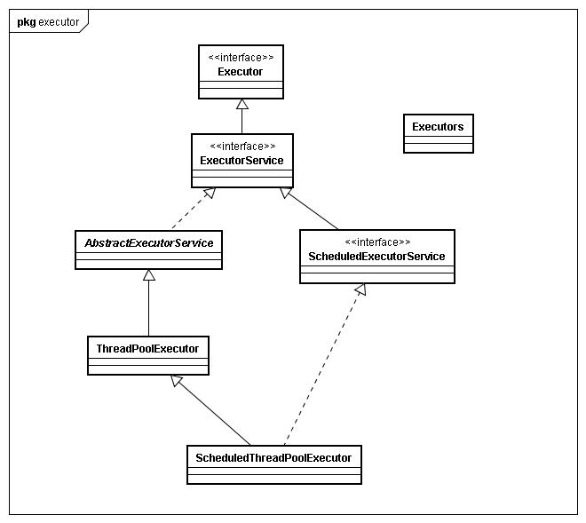
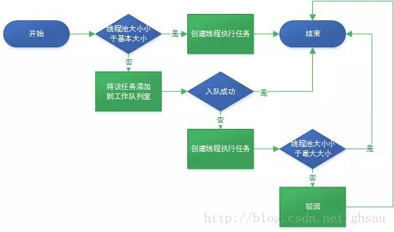

# Executor

Eexecutor作为灵活且强大的异步执行框架，其支持多种不同类型的任务执行策略，提供了一种标准的方法将任务的提交过程和执行过程解耦开发，基于生产者-消费者模式，其提交任务的线程相当于生产者，执行任务的线程相当于消费者，并用Runnable来表示任务，Executor的实现还提供了对生命周期的支持，以及统计信息收集，应用程序管理机制和性能监视等机制。

# ExecutorService

ExecutorService是Executor直接的扩展接口，也是最常用的线程池接口，我们通常见到的线程池定时任务线程池都是它的实现类。



# ThreadPoolExecutor

java的线程池支持主要通过ThreadPoolExecutor来实现，我们使用的ExecutorService的各种线程池策略都是基于ThreadPoolExecutor实现的，所以ThreadPoolExecutor十分重要。要弄明白各种线程池策略，必须先弄明白ThreadPoolExecutor。

## 构造参数说明

```
public ThreadPoolExecutor(int corePoolSize,
                          int maximumPoolSize,
                          long keepAliveTime,
                          TimeUnit unit,
                          BlockingQueue<Runnable> workQueue,
                          ThreadFactory threadFactory,
                          RejectedExecutionHandler handler)
```

参数说明：

-  corePoolSize：核心线程数，如果运行的线程少于corePoolSize，则创建新线程来执行新任务，即使线程池中的其他线程是空闲的。

-  maximumPoolSize：最大线程数，可允许创建的线程数。

-  keepAliveTime：如果线程数多于corePoolSize,则这些多余的线程的空闲时间超过keepAliveTime时将被终止。

- unit：keepAliveTime参数的时间单位。

-  workQueue：保存任务的阻塞队列。                                                                                                                当运行的线程数少于corePoolSize时，在有新任务时直接创建新线程来执行任务而无需再进队列 ；

  当运行的线程数等于或多于corePoolSize，在有新任务添加时则选加入队列，不直接创建线程 ；

  当队列满时，在有新任务时就创建新线程。

-  threadFactory：使用ThreadFactory创建新线程，默认使用defaultThreadFactory创建线程。

-  handler： 定义处理被拒绝任务的策略，默认使用 ThreadPoolExecutor.AbortPolicy， 抛出RejectExecutorException。

## 执行任务流程



## 拒绝策略

- ThreadPoolExecutor.AbortPolicy：默认策略，抛出RejectExecutorException。
- ThreadPoolExecutor.CallerRunsPolicy：改为本地线程同步执行任务。
- ThreadPoolExecutor.DiscardPolicy：丢弃任务。
- ThreadPoolExecutor.DiscardOldestPolicy：从阻塞队列中取出队首的任务丢弃，然后推入队列。

## 生命周期

- RUNNING：初始状态，接受新任务并且处理已经在队列中的任务。
- SHUTDOWN：不接受新任务，但处理队列中的任务。
- STOP：不接受新任务，不处理排队的任务，并中断正在进行的任务。
- TIDYING：所有任务已终止，workerCount为零，线程转换到状态TIDYING，这时回调terminate()方法。
- TERMINATED：终态，terminated()执行完成。

shutdown()：平缓的关闭。不再接受新的任务，同事等待已经提交的任务执行完成，包括未执行的任务。

shutdownNow()：暴力的关闭。取消所有运行中的任务，并且不再执行队列中尚未执行的任务。

# Executors

Executors提供了一系列静态工厂方法用于创建各种线程池。

## newFixedThreadPool

创建一个固定长度的线程池，每当提交一次任务时就创建一个线程，直到达到线程池的最大数量，这时线程池的规模将不再变化。

```
public static ExecutorService newFixedThreadPool(int nThreads) { 
        return new ThreadPoolExecutor(nThreads, 
                                      nThreads, 
                                      0L,
                                      TimeUnit.MILLISECONDS, 
                                      new LinkedBlockingQueue<Runnable>()); 
}
```

 corePoolSize与 maximumPoolSize数量相等，表示线程池将维护固定数量的线程。使用了无界的 LinkedBlockingQueue队列，所以可以一直添加新任务到线程池，不会触发拒绝机制。

## newCachedThreadPool

创建一个可换成的线程池，如果线程池的当前规模超过了需要处理的任务数量时，那么将回收空闲的线程；而当 需要处理的任务数量增加时，则添加新的线程。线程池的规模不存在任何限制。

```
public static ExecutorService newCachedThreadPool() {
        return new ThreadPoolExecutor(0, 
                                      Integer.MAX_VALUE,
                                      60L, 
                                      TimeUnit.SECONDS,
                                      new SynchronousQueue<Runnable>());
}
```

 corePoolSize为0， maximumPoolSize为 Integer.MAX_VALUE表示线程池容量为无限。闲置60秒的线程将被回收。 SynchronousQueue是一个阻塞的同步队列， 队列只能存储一个元素。因此，线程池会不断创建新的线程，极端场景下会因为线程数量过多而耗尽计算机资源。

## newSingleThreadExecutor

一个单线程的Executor，创建单个工作线程来执行任务；如果线程异常，则创建另一个线程来替代。

```
public static ExecutorService newSingleThreadExecutor() {
        return new FinalizableDelegatedExecutorService
            (new ThreadPoolExecutor(1, 
                                    1,
                                    0L, 
                                    TimeUnit.MILLISECONDS,
                                    new LinkedBlockingQueue<Runnable>()));
}
```

## newScheduledThreadPool

创建一个固定长度的线程池，而且以延迟或定时的方式来执行任务。

```
public ScheduledThreadPoolExecutor(int corePoolSize) {
        super(corePoolSize, Integer.MAX_VALUE, 0, NANOSECONDS,
              new DelayedWorkQueue());
    }
```

### ScheduledExecutorService

ScheduledExecutorService一种安排任务执行的ExecutorService，任务可以延迟执行，或者在一个固定的时间间隔内重复执行。

```
//创建定时器线程池
ScheduledExecutorService executorService = Executors.newScheduledThreadPool(1);
```

| 常用方法                                                     | 方法说明                                                     | 重要参数说明                                       |
| ------------------------------------------------------------ | ------------------------------------------------------------ | -------------------------------------------------- |
| schedule(Runnable command, long delay, TimeUnit unit)        | 延后指定时间执行任务                                         | delay:延后指定时间执行任务                         |
| scheduleAtFixedRate(Runnable command, long initialDelay, long period, TimeUnit unit) | 周期的执行任务，一次只能执行一个任务，当前一个任务没有执行完，而周期时间到了，则下一个任务等待前一个任务执行完毕之后立即执行 | initialDelay:延后指定时间执行任务；period:定期执行 |
| scheduleWithFixedDelay(Runnable command, long initialDelay, long period, TimeUnit unit) | 周期的执行任务，当前一个任务执行完毕后，开始计时             | initialDelay:延后指定时间执行任务；period:定期执行 |

# 设置线程池的大小

设置线程池的大小时，应避免过大或过小这两种极端情况。如果线程池过大，那么大量的线程将在相对很少的CPU和内存资源上发生竞争，降低系统性能，耗费服务器资源。如果线程池过小，那么将导致许多空闲的处理器无法执行工作，浪费资源。要想正确的设置线程池的大小，需要分析计算㕂、资源预算和任务特性。

## 对于计算密集型任务

```
N = 线程数量
C = CPU数量
N = C + 1
```

## 对于IO密集型任务

```
N = 线程数量
C = CPU数量
P = CPU利用率
CT = 计算时间
WT = IO等待时间
N = C * P * (1 + CT/WT)
```

当然，CPU周期并不是唯一影响线程池大小饿资源，还包括内存、文件句柄、套接字句柄和数据库连接等。计算这些资源对线程池的约束条件是更容易的：计算每个任务对该资源的需求量，然后用该资源的可用总量除以每个任务的需求量，所得结果就是线程池大小的上线。