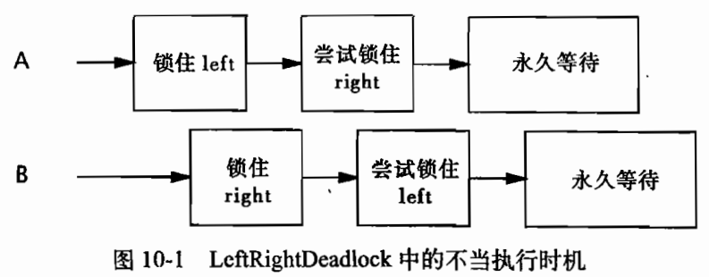
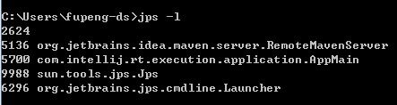
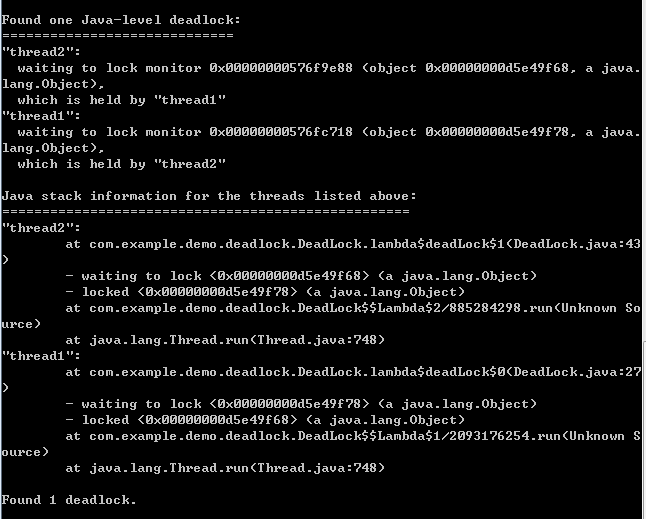

# AQS

AQS是AbstractQueuedSynchronizer类的简称，即队列同步器。它是构建锁或者其他同步组件的基础框架。

AQS定义两种资源共享方式：Exclusive（独占，只有一个线程能执行，如ReentrantLock）和Share（共享，多个线程可同时执行，如Semaphore/CountDownLatch）。

AQS 使用一个 volatile int 类型的成员变量 state 来表示同步状态：

- 当 state > 0 时，表示已经获取了锁。
- 当 state = 0 时，表示释放了锁。

AQS 通过内置的 FIFO 同步队列来完成资源获取线程的排队工作。如果当前线程获取同步状态失败（锁）时，AQS 则会将当前线程以及等待状态等信息构造成一个节点（Node）并将其加入同步队列，同时会阻塞当前线程 当同步状态释放时，则会把节点中的线程唤醒，使其再次尝试获取同步状态。


# CAS

 CAS （Compare and Swap），即比较并替换。指的是现代 CPU 广泛支持的一种对内存中的共享数据进行操作的一种特殊指令。这个指令会对内存中的共享数据做原子的读写操作。简单介绍一下这个指令的操作过程：首先，CPU 会将内存中将要被更改的数据与期望的值做比较。然后，当这两个值相等时，CPU 才会将内存中的数值替换为新的值。否则便不做操作。最后，CPU 会将旧的数值返回。这一系列的操作是原子的。

 CAS的思想很简单：三个参数，一个当前内存值V、旧的预期值A、即将更新的值B，当且仅当预期值A和内存值V相同时，将内存值修改为B并返回true，否则什么都不做，并返回false。

AtomicInteger中的compareAndSet()方法：

```java
 public final boolean compareAndSet(int expect, int update) {   
    return unsafe.compareAndSwapInt(this, valueOffset, expect, update);
 
}
```

## 问题

CAS存在一个很明显的问题，即ABA问题。

问题：如果变量V初次读取的时候是A，并且在准备赋值的时候检查到它仍然是A，那能说明它的值没有被其他线程修改过了吗？

如果在这段期间曾经被改成B，然后又改回A，那CAS操作就会误认为它从来没有被修改过。针对这种情况，java并发包中提供了一个带有标记的原子引用类。

# volatile

volatile是一种稍弱的同步机制，用来确保将变量的更新操作通知到其他线程。当把变量声明为volatile类型之后，编译器与运行时都会注意到这个变量是共享的。访问volatile变量时，不会执行加锁操作，因此不会使线程发送阻塞。

volatile变量只能保证内存中的可见性，而不能保证互斥性。根据这个特性，volatile变量常用来表示状态。

# synchronized

-  修饰一个代码块，被修饰的代码块称为同步语句块，其作用的范围是大括号{}括起来的代码，作用的对象是调用这个代码块的对象；
-  修饰一个方法，被修饰的方法称为同步方法，其作用的范围是整个方法，作用的对象是调用这个方法的对象；
-  修改一个静态的方法，其作用的范围是整个静态方法，作用的对象是这个类的所有对象；
-  修改一个类，其作用的范围是synchronized后面括号括起来的部分，作用的对象是这个类的所有对象。

 synchronized锁是可重入的。synchronized既能保证互斥性，也能保证内存可见性。

# Lock

Lock是java中的显示锁。

## ReentrantLock

ReentrantLock实现了Lock接口，并提供了与synchronized相同的互斥性和内存可见性。ReentrantLock锁也是可重入锁。

```java
public interface Lock {

    void lock();
	
    void lockInterruptibly() throws InterruptedException;
    
    boolean tryLock();
    
    boolean tryLock(long time, TimeUnit unit) throws InterruptedException;
	
    void unlock();
	
    Condition newCondition();
}
```

## 公平锁与非公平锁

```java
public ReentrantLock(boolean fair) {
    sync = fair ? new FairSync() : new NonfairSync();
}
```

- **公平锁**：线程按照他们发出请求的顺序获取锁
- **非公平锁**： 当一个线程请求非公平锁时，如果在发出请求的同时该锁变成可用状态，那么这个线程会跳过队列中所有的等待线程而获得锁。

在公平的锁中，如果有另一个线程持有锁或者有其他线程在等待队列中等待这个所，那么新发出的请求的线程将被放入到队列中。而非公平锁上，只有当锁被某个线程持有时，新发出请求的线程才会被放入队列中。 非公平锁的性能要优于公平锁。

## 读写锁

一个资源可以被多个读操作访问，或者被一个写操作访问，但不能两者同时进行。

```java
public interface ReadWriteLock {

    Lock readLock();
	
    Lock writeLock();
}
```

对于在多处理器系统上被频繁读取饿数据结构，读写锁能提高性能；而在其他场景下，读写锁的性能要差于独占锁，因为读写锁的复杂性更高。

## synchronized与Lock的比较

| 类别     | synchronized                                                 | Lock                                            |      |
| -------- | ------------------------------------------------------------ | ----------------------------------------------- | ---- |
| 实现机制 | 悲观锁                                                       | 乐观锁                                          |      |
| 操作层次 | Java的关键字，JVM层面                                        | Java代码层面                                    |      |
| 锁的释放 | 1、以获取锁的线程执行完同步代码，释放锁；2、线程执行发生异常，jvm会让线程释放锁 | 在finally中必须释放锁，不然容易造成线程死锁     |      |
| 锁的状态 | 无法判断                                                     | 可以判断                                        |      |
| 锁的类型 | 互斥性 内存可见性 可重入 不可中断 非公平                     | 互斥性 内存可见性 可重入 可判断 可公平 可非公平 |      |

# 死锁

## 原因



 两个线程试图以不同的顺序来获取相同的锁。

## 四个必要条件

-  **互斥使用**，即当资源被一个线程使用(占有)时，别的线程不能使用。
-  **不可抢占**，资源请求者不能强制从资源占有者手中夺取资源，资源只能由资源占有者主动释放。
-  **请求和保持**，即当资源请求者在请求其他的资源的同时保持对原有资源的占有。
-  **循环等待**，即存在一个等待队列：线程1占有A资源的同时想要获取B资源，而线程2占有B资源的同时想要获取A资源；于是便形成了一个等待队列。

 当上述四个条件都成立的时候，便形成死锁。当然，死锁的情况下如果打破上述任何一个条件，便可让死锁消失。

## 死锁的诊断

### JVM工具

#### jps -l

查看JVM进程



#### jstack {pid}

查看pid进程的堆栈信息



## 避免死锁的方法

### 定时锁

使用Lock类中的定时tryLock功能来代替内置锁。指定一个超时时间，再等待时间超过设置的时间后，返回失败信息或回滚重新尝试获取所有锁；避免永远等待，造成死锁。

# 分布式锁

## redis实现分布式锁

 redis通常可以使用setnx来实现分布式锁。setnx来创建一个key，并设置过期时间。如果key不存在则创建成功返回1，如果key已经存在则返回0。依照上述来判定是否获取到了锁获取到锁的执行业务逻辑，完毕后删除lock_key，来实现释放锁其他未获取到锁的则进行不断重试，直到自己获取到了锁

```java
public void lock(){
    while(true){
        ret = set lock_key identify_value nx ex lock_timeout
        if(ret){
            //获取到了锁
            return;
        }
        sleep(100);
    }
}

public void release(){
    value = get lock_key
    if(identify_value == value){
        del lock_key
    }
}
```

### 问题

1、 lock timeout的存在也使得失去了锁的意义，即存在并发的现象。一旦出现锁的租约时间，就意味着获取到锁的客户端必须在租约之内执行完毕业务逻辑，一旦业务逻辑执行时间过长，租约到期，就会引发并发问题。所以有lock timeout的可靠性并不是那么的高。

2、 redis单机情况下，还存在redis单点故障的问题。如果为了解决单点故障而使用redis的sentinel或者cluster方案，则更加复杂，引入的问题更多。

### 死锁

如果进程获得锁后，断开了与 Redis 的连接（可能是进程挂掉，或者网络中断），如果没有有效的释放锁的机制，那么其他进程都会处于一直等待的状态，即出现“死锁”。

### 解决办法

在使用 SETNX 获得锁时，我们将键lock的值设置为锁的有效时间，进程获得锁后，其他进程还会不断的检测锁是否已超时，如果超时，那么等待的进程也将有机会获得锁。当前进程需要在超时时退出，否则超时后，其他进程有可能拿到锁导致多个进程同时拿到锁。 

当判断锁超时时，我们不能简单地使用 DEL命令删除键lock以释放锁。因为这样会操作多个并发现场依次删除，同时获取锁的情况。例如A线程删除了死锁，并正要设置新的锁，而B进程删除了A新设置的锁，又加了一把新锁。

既然不能删除lock，则可以通过redis的GETSET操作。由于GETSET操作在设置键的值的同时，还会返回键的旧值，通过比较键 lock的旧值是否小于当前时间，可以判断进程是否已获得锁。

## ZooKeeper实现分布式锁

获取锁

```java
public void lock(){
    path = 在父节点下创建临时顺序节点
    while(true){
        children = 获取父节点的所有节点
        if(path是children中的最小的){
            代表获取了节点
            return;
        }else{
            添加监控前一个节点是否存在的watcher
            wait();
        }
    }
}

watcher中的内容{
    notifyAll();
}
```

释放锁

```java
public void release(){
    删除上述创建的节点
}
```

**锁的占用时间限制**：redis就有占用时间限制，而ZooKeeper则没有，最主要的原因是redis目前没有办法知道已经获取锁的客户端的状态，是已经挂了呢还是正在执行耗时较长的业务逻辑。而ZooKeeper通过临时节点就能清晰知道，如果临时节点存在说明还在执行业务逻辑，如果临时节点不存在说明已经执行完毕释放锁或者是挂了。

**是否单点故障**：redis本身有很多中玩法，如客户端一致性hash，服务器端sentinel方案或者cluster方案，很难做到一种分布式锁方式能应对所有这些方案。而ZooKeeper只有一种玩法，多台机器的节点数据是一致的，没有redis的那么多的麻烦因素要考虑。

 总体上来说ZooKeeper实现分布式锁更加的简单，可靠性更高。